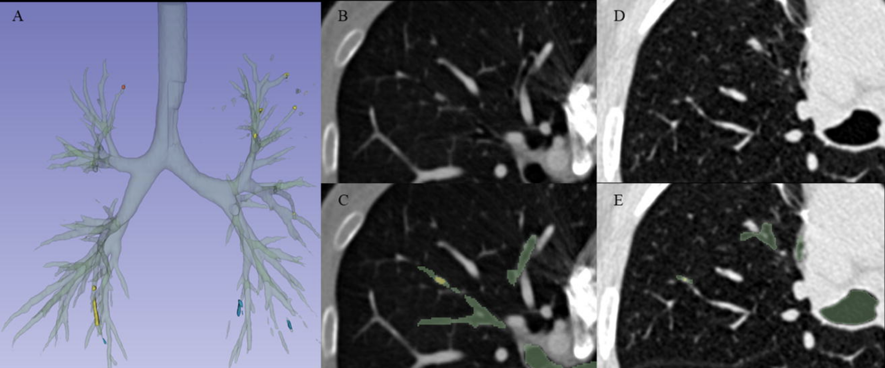

# Mucus Plug Detector

In our Institutional Review Board (IRB) approved retrospective study, we developed a model to detect mucus plugs from HRCT images. The ground_truth directory contains corresponding masks for cases with mucus plugs among 14 HRCT files from LIDC-IDRI dataset. Cases without files indicate the absence of mucus plugs.


### Performance Summary

| Dataset | Sensitivity | PPV | Cases | Total Plugs |
|---------|------------|-----|-------|-------------|
| **In-house Dataset** | 93.8% (228/243) | 18.8% (228/1211) | 33 | 0-74 per case |
| **External LIDC-IDRI Dataset** | 82.8% (24/29) | 23.5% (24/102) | 14 | 0-17 per case |

### Detailed Per-Case Performance

<details>
<summary>In-House Dataset (33 cases)</summary>

| Case | True Positives | False Negatives | False Positives | Number of Lesions |
|------|---------------|-----------------|-----------------|-------------------|
| 1 | 1 | 0 | 4 | 1 |
| 2 | 0 | 0 | 7 | 0 |
| 3 | 11 | 0 | 4 | 11 |
| 4 | 5 | 1 | 15 | 6 |
| 5 | 2 | 0 | 11 | 2 |
| 6 | 14 | 0 | 51 | 14 |
| 7 | 5 | 0 | 9 | 5 |
| 8 | 6 | 0 | 27 | 6 |
| 9 | 0 | 0 | 13 | 0 |
| 10 | 0 | 0 | 1 | 0 |
| 11 | 4 | 1 | 8 | 5 |
| 12 | 0 | 0 | 86 | 0 |
| 13 | 3 | 0 | 31 | 3 |
| 14 | 0 | 0 | 0 | 0 |
| 15 | 4 | 0 | 106 | 4 |
| 16 | 0 | 0 | 9 | 0 |
| 17 | 0 | 0 | 62 | 0 |
| 18 | 0 | 0 | 5 | 0 |
| 19 | 72 | 2 | 78 | 74 |
| 20 | 0 | 0 | 25 | 0 |
| 21 | 0 | 0 | 14 | 0 |
| 22 | 0 | 0 | 8 | 0 |
| 23 | 2 | 0 | 55 | 2 |
| 24 | 2 | 0 | 17 | 2 |
| 25 | 20 | 0 | 75 | 20 |
| 26 | 4 | 0 | 14 | 4 |
| 27 | 54 | 9 | 78 | 63 |
| 28 | 3 | 1 | 54 | 4 |
| 29 | 1 | 0 | 1 | 1 |
| 30 | 0 | 0 | 24 | 0 |
| 31 | 0 | 0 | 6 | 0 |
| 32 | 6 | 1 | 80 | 7 |
| 33 | 9 | 0 | 5 | 9 |
| **Total** | **228** | **15** | **983** | **243** |

</details>

<details>
<summary>External LIDC-IDRI Dataset (14 cases)</summary>

| Case | True Positives | False Negatives | False Positives | Number of Lesions |
|------|---------------|-----------------|-----------------|-------------------|
| 318 | 0 | 0 | 1 | 0 |
| 345 | 0 | 0 | 7 | 0 |
| 428 | 12 | 5 | 4 | 17 |
| 441 | 2 | 0 | 3 | 2 |
| 445 | 0 | 0 | 6 | 0 |
| 487 | 0 | 0 | 3 | 0 |
| 513 | 0 | 0 | 1 | 0 |
| 524 | 0 | 0 | 4 | 0 |
| 525 | 1 | 0 | 7 | 1 |
| 717 | 2 | 0 | 8 | 2 |
| 801 | 0 | 0 | 1 | 0 |
| 808 | 6 | 0 | 8 | 6 |
| 814 | 1 | 0 | 23 | 1 |
| 825 | 0 | 0 | 2 | 0 |
| **Total** | **24** | **5** | **78** | **29** |

</details>




## Usage

Download the models from the following link and place the directory in the root directory of the repository:
https://drive.google.com/drive/folders/1mGL0g-UyrwLhiaPMtvBl5tcRu9CN9oWe?usp=sharing

The image files corresponding to the LIDC-IDRI dataset used in the paper are also available at this link.

Please create an image and run a container following the provided Dockerfile. Please mount this directory.
Place your nii.gz files in the inference_input directory.
We recommend using HRCT data with finer resolution than 0.5mm in x and y directions, and thinner than 1mm resolution in z direction.

### Inference Mucus + Airway Mask
This will process nii.gz files in the inference_input directory and output a single mask containing both airways and mucus plugs (including thickened bronchi) to the inference_output directory. Airways will be predicted regardless of their distance from the lung periphery.
The directory structure should be as follows. The process works on CPU as well.


```bash
.
└── inference_input
    ├── 000.nii.gz
    ├── 001.nii.gz
    └── ...
```

```bash
python src/inference.py
```

### Generate Mucus Prediction
Based on the nii.gz files in both inference_input and inference_output directories, this will output mucus plug predictions to the inference_mucus directory. Airways will be predicted regardless of their distance from the lung periphery.


```bash
python src/detect_mucus.py
```

### Train Model
This will train the model using nii.gz files from train_input and train_airway directories.
Please place lung field masks corresponding to train_input files in the train_lungmask directory.
The process will generate weight maps, resize the data, and perform training.
The directory structure should be as follows.


```bash
.
├── train_input
│   ├── 000.nii.gz
│   ├── 001.nii.gz
│   └── ...
├── train_lungmask
│   ├── 000.nii.gz
│   ├── 001.nii.gz
│   └── ...
└── train_airway
    ├── 000.nii.gz
    ├── 001.nii.gz
    └── ...
```


```bash
python src/create_weightmap.py
python src/change_resolution_with_weightmap.py
python src/train.py
```

### Create Lung Mask
This will predict lung fields within 2cm from the lung periphery.


```bash
python src/pipeline.py
```

### Acknowledgement

This code and the following paper utilize these tools and datasets:

- [ATM'22](https://atm22.grand-challenge.org/)
- [LIDC-IDRI](https://www.cancerimagingarchive.net/collection/lidc-idri/)
- [lungmask](https://github.com/JoHof/lungmask)
- [TotalSegmentator](https://github.com/wasserth/TotalSegmentator)

The authors acknowledge the National Cancer Institute and the Foundation for the National Institutes of Health, and their critical role in the creation of the free publicly available LIDC/IDRI Database used in this study.

### Citation

Please cite our work if you find it helpful.

```bibtex
@article{sonoda2025deep,
 title={A deep learning-based automated detection of mucus plugs in chest CT},
 author={Sonoda, Yuki and Fukuda, Kensuke and Matsuzaki, Hirotaka and Yamagishi, Yosuke and Miki, Soichiro and Nomura, Yukihiro and Mikami, Yu and Yoshikawa, Takeharu and Hanaoka, Shouhei and Kage, Hidenori and Abe, Osamu},
 journal={ERJ Open Research},
 publisher={European Respiratory Society (ERS)},
 pages={00377--02025},
 month={8},
 year={2025},
 doi={10.1183/23120541.00377-2025},
 url={https://doi.org/10.1183/23120541.00377-2025}
}

```
